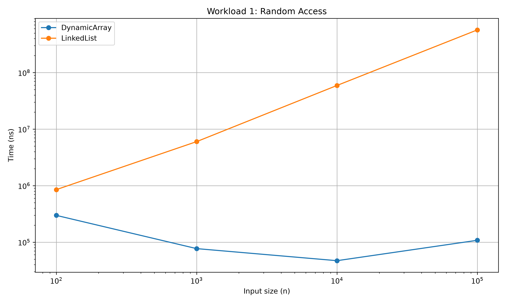
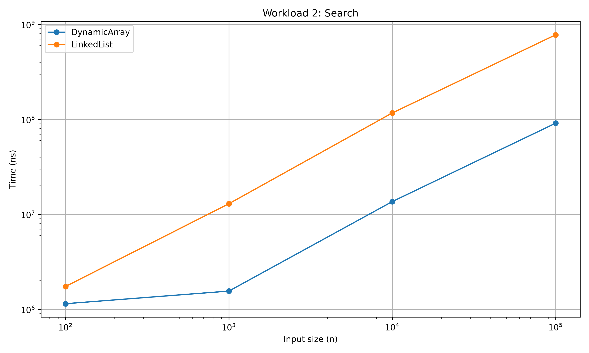
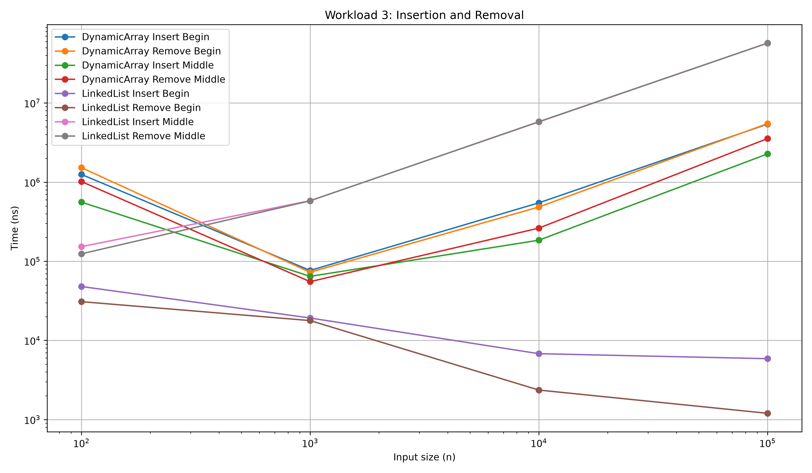
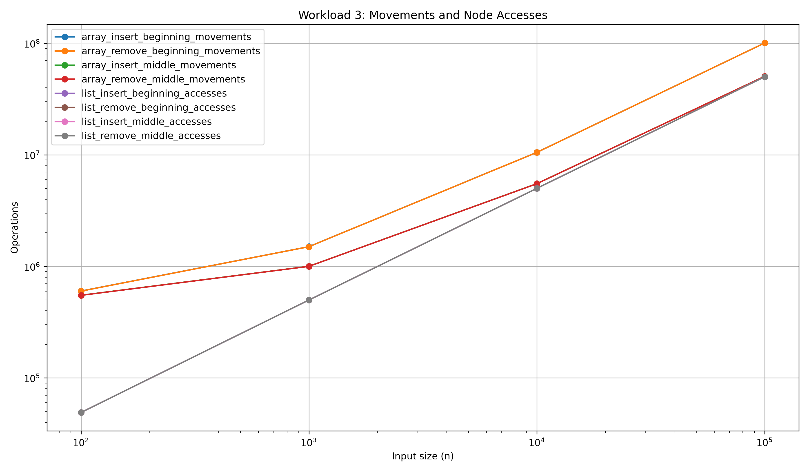
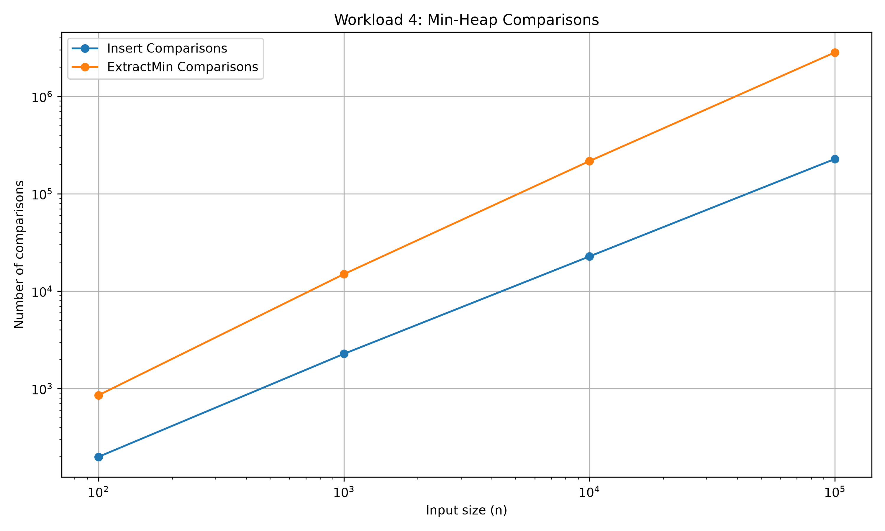
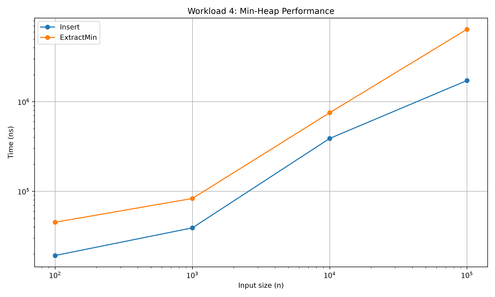

# Assignment 2 — Data Structures and Algorithm Analysis

## 1. Introduction

This project compares the performance of three data structures:

* `DynamicArray`
* `LinkedList`
* `MinHeap`

The main goal is to see how different data structures behave when the input size becomes larger.

The experiments use the following input sizes:

```text
100
1000
10000
100000
```

Each experiment is repeated **5 times**, and the average execution time is recorded.

---

# 2. Project Structure

The project contains the following main files:

```text
Assignment2DAA/
│
├── src/
│   ├── DynamicArray.java
│   ├── LinkedList.java
│   ├── MinHeap.java
│   └── Benchmark.java
│
├── results/
│   ├── tables/
│   │   ├── workload1_random_access.csv
│   │   ├── workload2_search.csv
│   │   ├── workload3_insertion_removal.csv
│   │   └── workload4_min_heap.csv
│   │
│   ├── plot_results.py
│   │
│   ├── workload1_random_access.png
│   ├── workload2_search.png
│   ├── workload3_insertion_removal.png
│   ├── workload3_operations.png
│   ├── workload4_min_heap_time.png
│   └── workload4_min_heap_comparisons.png
│
└── README.md
```

---

# 3. Workload 1 — Random Access

The first experiment measures how quickly an element can be accessed by its index.

For example:

```text
array.get(500)
list.get(500)
```

The experiment performs many random accesses for different input sizes.

### Expected behavior

`DynamicArray` should be faster for random access because an array can directly access an element by its index.

The time complexity is:

| Data structure | Random access |
| -------------- | ------------: |
| DynamicArray   |          O(1) |
| LinkedList     |          O(n) |

For `LinkedList`, the program has to move through nodes until it reaches the requested position.

### Results

The complete numerical results are stored in:

[workload1_random_access.csv](results/tables/workload1_random_access.csv)

### Graph



### Discussion

The graph shows the difference between array-based and linked-list access.

As the input size increases, random access in `LinkedList` becomes more expensive because more nodes may need to be visited.

`DynamicArray` does not need to move through previous elements, so its random access performance is much more stable.

---

# 4. Workload 2 — Search

The second experiment measures the time required to search for values.

The program performs multiple `contains()` operations for different input sizes.

### Time complexity

| Data structure | Search |
| -------------- | -----: |
| DynamicArray   |   O(n) |
| LinkedList     |   O(n) |

Both structures use a linear search.

This means that in the worst case the program may need to check many elements before finding the requested value.

### Results

The complete numerical results are stored in:

[Workload 2 CSV](tables/workload2_search.csv)

### Graph



### Discussion

Both data structures have linear search complexity.

The main difference is how the elements are stored in memory:

* `DynamicArray` stores elements in a continuous array.
* `LinkedList` stores elements in separate nodes connected by links.

The benchmark shows the actual execution-time difference for the tested input sizes.

---

# 5. Workload 3 — Insertion and Removal

The third experiment measures insertion and removal operations.

The operations are tested at:

* the beginning of the structure;
* the middle of the structure.

Each operation is performed 1000 times.

The tested operations are:

```text
DynamicArray insert at beginning
DynamicArray remove at beginning

DynamicArray insert at middle
DynamicArray remove at middle

LinkedList insert at beginning
LinkedList remove at beginning

LinkedList insert at middle
LinkedList remove at middle
```

---

## 5.1 DynamicArray

When an element is inserted at the beginning or in the middle, existing elements have to be shifted.

For example:

```text
Before:

[10, 20, 30, 40]

Insert 5 at index 0:

[5, 10, 20, 30, 40]
```

Several elements have to move.

Therefore, insertion and removal in these positions require element movements.

---

## 5.2 LinkedList

A linked list does not need to move all elements.

Instead, it changes links between nodes.

For example:

```text
10 -> 20 -> 30 -> 40

After inserting 15:

10 -> 15 -> 20 -> 30 -> 40
```

However, the program may need to travel through the list to reach the required position.

Therefore, the cost depends on both:

* finding the position;
* changing the links.

---

## 5.3 Results

The complete benchmark results are stored in:

[Workload 3 CSV](tables/workload3_insertion_removal.csv)

### Execution time graph



### Movements and accesses graph



### Discussion

The results demonstrate an important difference between the two structures.

`DynamicArray` may need many element movements when inserting or removing near the beginning or middle.

`LinkedList` does not need to move the existing elements, but it may need to access many nodes to reach the required position.

This is why the two data structures behave differently even when the operation itself looks similar.

---

# 6. Workload 4 — MinHeap

The fourth experiment tests the `MinHeap` data structure.

The following operations are measured:

```text
insert()
extractMin()
```

The heap is tested with the same input sizes:

```text
100
1000
10000
100000
```

---

## 6.1 Insert

When a new element is inserted into a min-heap, it is initially placed at the end.

Then it may move upward until the heap property is restored.

The typical complexity is:

```text
O(log n)
```

---

## 6.2 ExtractMin

`extractMin()` removes the smallest element.

After removing the root, the last element is moved to the root and the heap is reorganized.

The typical complexity is:

```text
O(log n)
```

---

## 6.3 Correctness

The benchmark also checks that the extracted values are sorted.

For a correct min-heap, values returned by repeated `extractMin()` should be in non-decreasing order.

The benchmark records this using the `Sorted` result.

---

## 6.4 Results

The complete results are stored in:

[Workload 4 CSV](tables/workload4_min_heap.csv)

### Execution time



### Comparisons



### Discussion

The graphs show the execution time and number of comparisons for heap operations.

The number of operations grows as the input size increases, but heap operations are designed to avoid scanning the entire structure for each insertion or extraction.

The `Sorted` column is also used to check that `extractMin()` returns elements in the correct order.

---

# 7. Summary Table

The main theoretical complexities are summarized below.

| Operation           | DynamicArray | LinkedList |  MinHeap |
| ------------------- | -----------: | ---------: | -------: |
| Random access       |         O(1) |       O(n) |        — |
| Search              |         O(n) |       O(n) |        — |
| Insert at beginning |         O(n) |      O(1)* |        — |
| Remove at beginning |         O(n) |      O(1)* |        — |
| Insert in middle    |         O(n) |      O(n)* |        — |
| Remove in middle    |         O(n) |      O(n)* |        — |
| Insert              |            — |          — | O(log n) |
| Extract minimum     |            — |          — | O(log n) |

`*` For `LinkedList`, the link change itself is constant time once the required node has been reached. Reaching a middle position requires traversal.

---

# 8. Experimental Results

The benchmark was designed to compare theoretical complexity with actual execution time.

The experiments use:

```text
Input sizes:
100
1000
10000
100000

Repeats:
5
```

The results are stored as CSV files so they can also be opened in Excel or another spreadsheet program.

The Python script `plot_results.py` reads the CSV files and creates the graphs automatically.

---

# 9. Graphs

The project contains six graphs.

### Random Access


### Search


### Insertion and Removal


### Movements and Accesses


### MinHeap Time


### MinHeap Comparisons


---

# 10. Tables

The raw experimental data is available in CSV format.

### Workload 1

[Open Workload 1 table](tables/workload1_random_access.csv)

Contains:

* input size;
* DynamicArray execution time;
* LinkedList execution time.

### Workload 2

[Open Workload 2 table](tables/workload2_search.csv)

Contains:

* input size;
* DynamicArray search time;
* LinkedList search time.

### Workload 3

[Open Workload 3 table](tables/workload3_insertion_removal.csv)

Contains:

* insertion times;
* removal times;
* DynamicArray movements;
* LinkedList accesses.

### Workload 4

[Open Workload 4 table](tables/workload4_min_heap.csv)

Contains:

* insertion time;
* extraction time;
* insertion comparisons;
* extraction comparisons;
* correctness check.

---

# 11. Conclusions

The experiments show that different data structures are useful for different types of operations.

### DynamicArray

`DynamicArray` is useful when fast access by index is important.

Its main advantage is:

```text
Random access: O(1)
```

Its disadvantage is that inserting or removing elements near the beginning or middle may require many element movements.

---

### LinkedList

`LinkedList` is useful when elements need to be inserted or removed without shifting all other elements.

Its main disadvantage is access by index because the list has to be traversed.

Therefore:

```text
Random access: O(n)
```

---

### MinHeap

`MinHeap` is useful when the smallest element needs to be retrieved efficiently.

The main operations tested are:

```text
insert()
extractMin()
```

Both have logarithmic complexity in the usual binary min-heap implementation.

---

# 12. Final Conclusion

There is no single data structure that is best for every operation.

The choice depends on what the program needs to do most often.

In this project:

* `DynamicArray` is suitable for fast indexed access.
* `LinkedList` can be useful for insertion and removal when the required position has already been reached.
* `MinHeap` is suitable when the minimum element needs to be processed efficiently.

The benchmark results and graphs allow the theoretical complexity of the structures to be compared with their actual measured performance.

---

# 13. How to Run the Project

## Step 1 — Run the Java benchmark

Run:

```text
Benchmark.java
```

The program generates the CSV files in:

```text
results/tables/
```

---

## Step 2 — Generate graphs

Run:

```text
results/plot_results.py
```

The Python script reads the CSV files and creates six PNG graphs in:

```text
results/
```

---

## Step 3 — Check the results

The final project contains:

```text
CSV tables
+
PNG graphs
+
Java implementation
+
Python plotting script
+
README
```

These files provide both the implementation and the experimental analysis of the data structures.
